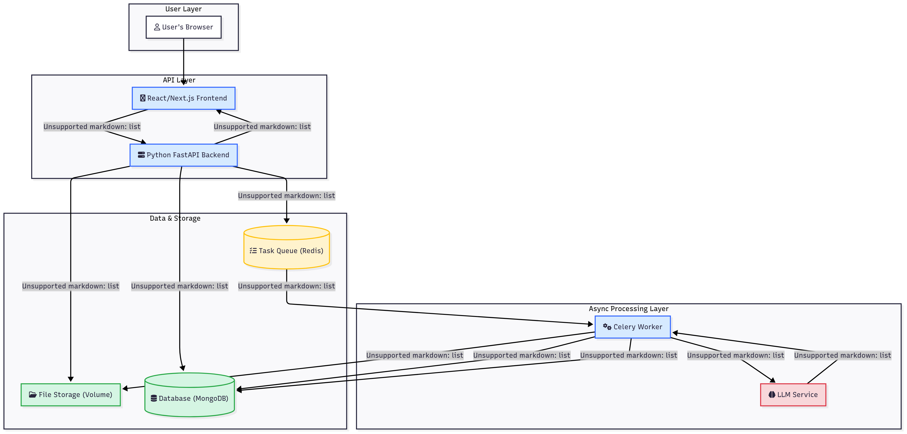

# Contract Intelligence Parser

This project implements a contract intelligence system for an accounts receivable SaaS platform, designed to automatically process contracts and extract critical financial and operational data.

## System Design

Here's an overview of the system architecture:



## Getting Started with Docker

To get the entire application stack (FastAPI backend, Celery worker, Redis, MongoDB, and the React frontend) up and running, you only need Docker and Docker Compose installed on your system.

1.  **Environment Variables:**
    Ensure you have your environment variables set up. The backend expects a `.env` file in the `backend/` directory (e.g., `backend/.env`) containing necessary configurations like `MONGO_URI`, `SUPABASE_URL`, `SUPABASE_KEY`, etc. Refer to `backend/.env.example` for required variables.

2.  **Navigate to the Project Root:**
    Open your terminal and navigate to the root directory of this project where the `docker-compose.yml` file is located.

    ```bash
    cd /path/to/TechAssignment
    ```
    (Replace `/path/to/TechAssignment` with the actual path to your project directory.)

3.  **Build and Start the Services:**
    This command will build all necessary Docker images (backend, worker, frontend) and start all the services defined in `docker-compose.yml` (backend, worker, frontend, MongoDB, Redis).

    ```bash
    docker compose up --build
    ```

    *   The `--build` flag ensures that the images are built (or rebuilt if changes are detected) before starting the containers. This is especially important for the first-time setup.
    *   To run the services in the background (detached mode), add the `-d` flag:
        ```bash
        docker compose up --build -d
        ```

4.  **Access the Application:**
    Once all services are up and running:
    *   The **Frontend** application will be accessible in your web browser at:
        [http://localhost:3000](http://localhost:3000)
    *   The **Backend API** will be running and accessible at:
        [http://localhost:8000](http://localhost:8000) (e.g., for API documentation at `http://localhost:8000/docs`)

5.  **Stop the Services:**
    To stop and remove the containers, networks, and volumes created by `docker compose up`:

    ```bash
    docker compose down
    ```

## Testing (within Docker)

If you need to run backend unit tests within the Docker environment, you can execute commands inside the running `backend` service container.

1.  **Find the backend service container ID/name:**
    ```bash
    docker ps
    ```
    Look for the container running the `backend` service.

2.  **Execute pytest:**
    ```bash
    docker exec <backend_container_id_or_name> pytest
    ```
    (Replace `<backend_container_id_or_name>` with the actual ID or name of your backend container.)
